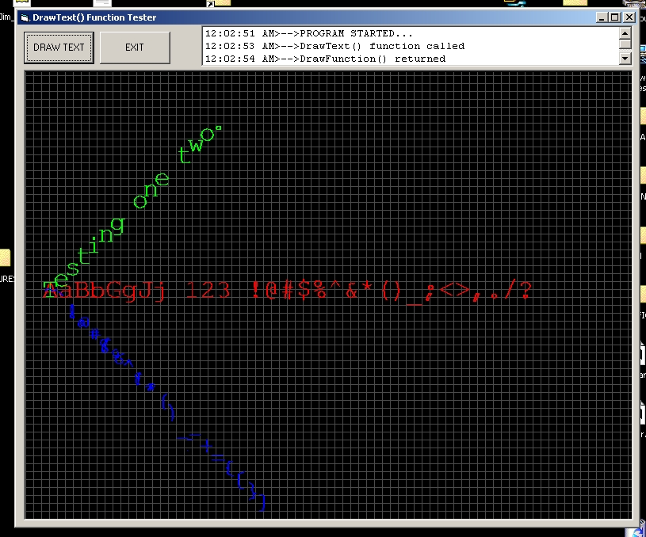

<div align="center">

## Draw Text as LINES on Picture Box


</div>

### Description

Occasionally, the ability to draw text on a picture box using the LINE method is needed, as it would allow complete control over a it's scale, location and other factors. This function accomplishes that by taking a string of characters and drawing them as lines, using the LINE method. Color, scale, rotation and other factors can be completely controlled.

The function is scale independent, so it doesn't matter if you're using twips, pixels, or any other measurement system. The letters are one square unit in size, by default. If you are using pixels, that means each character is one square pixel in size. If scaled up by a factor of 20, then one character would fit within exactly 20 pixels. You can control the scaling on both the X and Y-axis.

There are currently three fonts available, but fonts can be designed fairly easily. You can even design a font of your own handwriting. If you'd like to design your own font, just contact me at JamesTracy95820@gmail.com.

I wrote a little program that compiles the fonts from DXF files. I used AutoCAD release 14 to design the three fonts used by DrawText(), but any drawing program capable of outputting DXF files in AutoCAD release 14 format would work fine. I'd be happy to accept new fonts! The more the merrier. Be sure to contact me first, because there is an order to how the characters have to be arranged within a drawing file. As fonts are added, I'll either try to publish them somewhere, or you can just email me and ask if any new ones have been added - I'll send you the updated function if there are any.

ENJOY!

James Tracy

Sacramento, CA

JamesTracy95820@gmail.com
 
### More Info
 
Dim sdtParms(0 To 10) As Single

Dim idtParms(0 To 4) As Integer

These two arrays contains the parameters passed to the DrawText() function.

Nothing.

Nothing returned. The text is drawn on the specified object (usually a picture box).

None.


<span>             |<span>
---                |---
**Submitted On**   |2007-09-02 23:21:20
**By**             |[James Tracy](https://github.com/Planet-Source-Code/PSCIndex/blob/master/ByAuthor/james-tracy.md)
**Level**          |Beginner
**User Rating**    |5.0 (10 globes from 2 users)
**Compatibility**  |VB 6\.0
**Category**       |[Graphics](https://github.com/Planet-Source-Code/PSCIndex/blob/master/ByCategory/graphics__1-46.md)
**World**          |[Visual Basic](https://github.com/Planet-Source-Code/PSCIndex/blob/master/ByWorld/visual-basic.md)
**Archive File**   |[Draw\_Text\_208177932007\.zip](https://github.com/Planet-Source-Code/james-tracy-draw-text-as-lines-on-picture-box__1-69256/archive/master.zip)

### API Declarations

```
Dim sdtParms(0 To 10) As Single
Dim idtParms(0 To 4) As Integer
```


